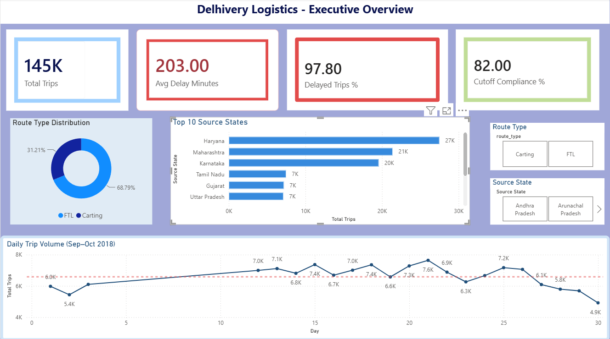
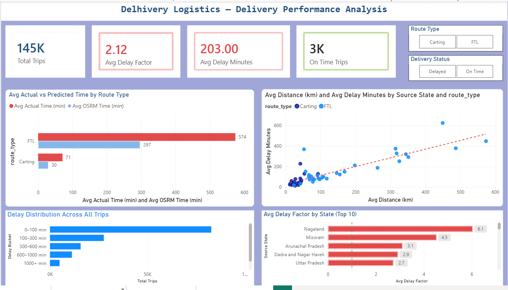
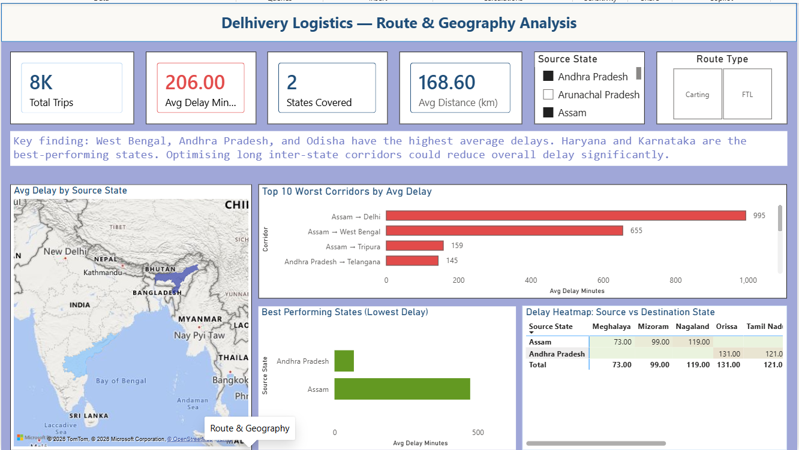
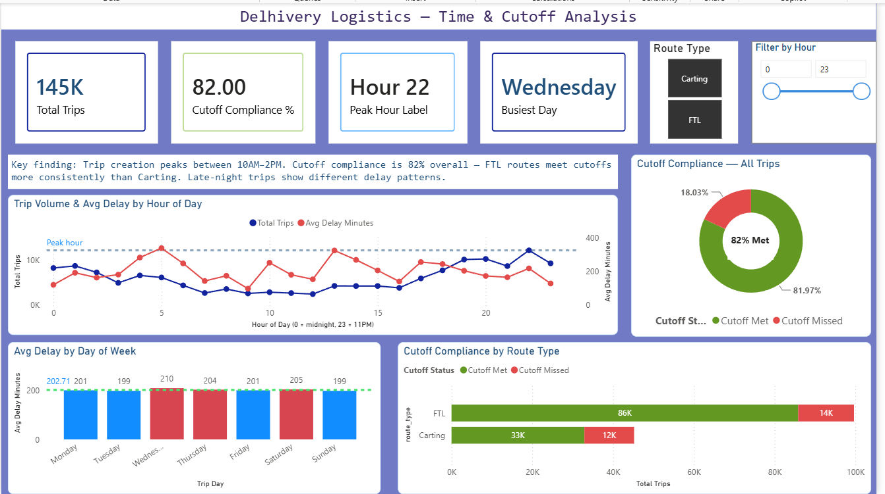

# Delhivery Logistics Analytics Dashboard

A 4-page Power BI dashboard analysing **144,867 trip-leg records** from Delhivery, India's largest logistics network, to measure delivery delays, cutoff compliance, and route performance across **32 Indian states**.

---

## Dashboard Preview



---

## Project Overview

This project takes Delhivery's raw trip-leg dataset (loaded from a single Excel workbook, `delhivery_data.xlsx`). It turns it into an interactive Power BI dashboard covering trip volumes, delay behaviour, cutoff (SLA) compliance, and geographic route performance. The model is built on one central fact table, **`Delhivery Data`**, with 13 custom DAX measures and 11 calculated columns layered on top of the raw fields to support the KPIs and visuals used throughout the report.

The underlying data spans trip creation timestamps from **12 September 2018 to 3 October 2018**, and retains a `dataset_split` field (`training` / `test`) inherited from the source file.

---

## Business Problem

Every trip in the dataset carries both an **actual delivery time** and an **OSRM-estimated (benchmark) time**, along with a cutoff timestamp flag. Comparing these fields surfaces the core operational problem the dashboard is built to investigate:

- Actual trip time consistently exceeds the OSRM benchmark — the average delay is **~203 minutes** per trip, and **97.8%** of trips run over the OSRM estimate.
- Only **82%** of trips meet their scheduled cutoff time, meaning roughly 1 in 5 trips (**~26,100 trips**) miss their SLA.
- Delay behaviour varies by route type (**FTL** vs **Carting**), by state, by corridor (source state → destination state), and by time of day/day of week — so a single average doesn't tell the full story.

The dashboard exists to help a logistics/operations audience drill into *where* and *when* delays and cutoff misses concentrate, rather than just reporting a single top-line delay number.

---

## Project Objectives

- Quantify overall trip volume, average delay, and cutoff (SLA) compliance across the network.
- Compare **FTL (Full Truck Load)** vs **Carting** route types on delay and cutoff performance.
- Identify which states and source→destination corridors carry the highest average delays.
- Analyze delay patterns by hour of day and day of week to spot peak-load and peak-delay windows.
- Provide slicers (route type, state, delay status, hour) so the same views can be filtered interactively.

---

## Dashboard Features

- **4 report pages**: Executive Overview, Delivery Performance, Route & Geography, Time & Cutoff Analysis
- **10 unique DAX measures** (Total Trips, Avg Delay Minutes, Cutoff Compliance %, Delayed Trips %, Avg Delay Factor, On Time Trips, Avg Distance (km), States Covered, Peak Hour Label, Busiest Day, plus supporting time measures)
- **KPI card visuals** on every page for at-a-glance metrics
- **Interactive slicers** for route type, source state, delayed/on-time status, and trip hour
- A **filled map** of source states, a **pivot table** cross-tabbing source vs. destination state by average delay, and **scatter, bar, line, and donut charts** for distribution and trend analysis
- Custom-formatted header banners and callout text boxes summarising page-level takeaways

---

## Tools & Technologies

- **Microsoft Power BI Desktop** — report authoring, data modeling, visualization
- **Power Query (M)** — data import and cleaning
- **DAX (Data Analysis Expressions)** — measures and calculated columns
- **Microsoft Excel** — source data format

---

## Dashboard Walkthrough

### 1. Executive Overview


The landing page gives a network-wide summary: four KPI cards for **Total Trips**, **Avg Delay Minutes**, **Delayed Trips %**, and **Cutoff Compliance %**. Below the cards, a donut chart breaks total trips down by **route type** (FTL vs. Carting), a horizontal bar chart shows total trips by **source state**, and a line chart plots trip volume over time using the trip creation date. Two slicers (route type, source state) let the whole page be filtered.

### 2. Delivery Performance


This page isolates delay and time metrics with KPI cards for **Total Trips**, **Avg Delay Minutes**, **Avg Delay Factor**, and **On Time Trips**. A clustered bar chart compares **Avg Actual Time** against **Avg OSRM Time** by route type, directly visualising the gap between planned and actual delivery time. A scatter chart plots **Avg Distance (km)** against **Avg Delay Minutes**, colored by source state and split by route type series, to check whether longer trips correlate with more delay. A bar chart buckets trips into delay ranges (**Delay Bucket**: Early, 0–100, 100–300, 300–600, 600–1000, 1000+ minutes), and a second bar chart shows **Avg Delay Factor** by source state. Slicers filter by route type and by delayed/on-time status.

### 3. Route & Geography


Four KPI cards summarize **Total Trips**, **Avg Delay Minutes**, **States Covered** (32), and **Avg Distance (km)**. A filled map plots source states with total trips shown on hover. Two clustered bar charts show average delay by **Corridor** (source state → destination state) and by **source state** directly. A pivot table cross-tabs **source state (rows) vs. destination state (columns)**, with **average delay minutes** as the value — letting a specific corridor's delay be looked up directly. Slicers filter by source state and route type.

> **Note on this page's callout text:** the on-dashboard summary names Haryana and Karnataka as "best-performing" and Andhra Pradesh as one of the highest-delay states. Recomputing average delay by source state from the underlying data shows the opposite for these three — Haryana and Karnataka are actually among the states with the *highest* average delay, while Andhra Pradesh is among the *lowest*. Odisha and West Bengal's inclusion as higher-delay states does hold up. Worth correcting the callout text in the .pbix before this goes on GitHub.

### 4. Time & Cutoff Analysis


KPI cards cover **Total Trips**, **Cutoff Compliance %** (82%), **Peak Hour Label**, and **Busiest Day**. A dual-axis line chart plots **Total Trips** and **Avg Delay Minutes** by **trip hour** (0–23), showing how volume and delay move together across the day. A clustered column chart shows **Avg Delay Minutes** by **trip day** (Monday–Sunday), with total trips available on hover. A donut chart breaks trips down by **Cutoff Status** ("Cutoff Met" vs. "Cutoff Missed"), and a stacked bar chart shows that same cutoff split by **route type** — this is where the FTL vs. Carting cutoff-compliance gap is visible directly. Slicers filter by route type and trip hour.

> **Note on this page's callout text:** the dashboard's text box states trip creation "peaks between 10AM–2PM." Recomputing trip counts by hour from the underlying data shows the actual peak volume hours are late evening/night (hour 22, then 20, 19, 23, and 1) — not the late-morning/early-afternoon window described. The FTL-vs-Carting cutoff compliance claim on this same page does check out against the data.

---

## Data Preparation

Data is loaded via **Power Query** from a single-sheet Excel workbook (`delhivery_data.xlsx`). The Power Query steps:

1. Promote the first row to column headers.
2. Set explicit data types for every column (dates/times as `datetime`, numeric fields as `Int64`/decimal, `is_cutoff` as `logical`, text fields as `text`).
3. Replace blank/null values in `source_name` and `destination_name` with `"unknown"`.
4. Remove identifier columns not needed for analysis (`trip_uuid`, `source_center`, `route_schedule_uuid`, `destination_center`).
5. Rename the `data` column to `dataset_split` (retaining the original train/test flag from the source file).

On top of this cleaned table, 11 **calculated columns** derive the analytical fields used across the report:

- **Source State / Destination State** — extracted from the parenthesized state code inside `source_name` / `destination_name` (e.g., pulling `"Bangalore (Karnataka)"` → `"Karnataka"`), with an `"Unknown"` fallback.
- **Delay Minutes** — `actual_time − osrm_time`.
- **Trip Hour** — hour extracted from `trip_creation_time`.
- **Is Delayed** — flags a trip as `"Delayed"` if `Delay Minutes > 0`, else `"On Time"`.
- **Delay Bucket** / **Delay Bucket Sort** — buckets `Delay Minutes` into ranges (Early, 0–100, 100–300, 300–600, 600–1000, 1000+ min) with a matching numeric sort key.
- **Corridor** — concatenates `Source State → Destination State`.
- **Trip Day** / **Day Sort Order** — day-of-week name and a matching numeric sort key from `trip_creation_time`.
- **Cutoff Status** — `"Cutoff Met"` / `"Cutoff Missed"` derived from the `is_cutoff` boolean.

---

## DAX Measures

The model uses 10 core DAX measures (plus a couple of internal helper measures) built on the `Delhivery Data` table:

| Measure | Logic |
|---|---|
| Total Trips | Row count of the fact table |
| Avg Delay Minutes | Average of `Delay Minutes`, rounded |
| Avg Delay Factor | Average of the `factor` column, rounded to 2 decimals |
| Delayed Trips % | Share of trips with `Delay Minutes > 0` |
| Cutoff Compliance % | Share of trips where `is_cutoff = TRUE` |
| Avg Distance (km) | Average of `actual_distance_to_destination` |
| On Time Trips | Count of trips with `Delay Minutes <= 0` |
| Avg Actual Time (min) | Average of `actual_time` |
| Avg OSRM Time (min) | Average of `osrm_time` |
| States Covered | Distinct count of `Source State` |
| Peak Hour Label | The `Trip Hour` with the highest `Total Trips`, formatted as `"Hour N"` |
| Busiest Day | The `Trip Day` with the highest `Total Trips` |

All measures follow simple `AVERAGE` / `COUNTROWS` / `DIVIDE` / `FILTER` patterns — no time-intelligence or advanced context-transition functions are used in this version of the model.

---

## Skills Demonstrated

- Power Query (M) data cleaning and transformation
- DAX calculated columns and measures
- Single-table (flat) data modeling
- KPI design and dashboard layout across multiple report pages
- Interactive filtering with slicers
- Geographic visualization (filled map)
- Cross-tabulation with matrix/pivot table visuals
- Data visualization (bar, line, scatter, donut, dual-axis charts)
- Business Intelligence storytelling — structuring one dataset into an overview page plus three focused drill-down pages

---

## Repository Structure

```
delhivery-logistics-analytics/
│
├── Delhivery_Logistics_Dashboard.pbix
├── README.md
└── images/
    ├── dashboard-overview.png
    ├── delivery-performance.png
    ├── route-geography-analysis.png
    └── time-cutoff-analysis.png
```

---

## Dataset

The original source dataset (`delhivery_data.xlsx`) is **not included in this repository** because it exceeds GitHub's file size upload limits. The `.pbix` file contains the full data model and can be opened directly in Power BI Desktop to explore the underlying table.

---

## Future Improvements

- Correct the on-dashboard callout text on the Route & Geography and Time & Cutoff Analysis pages so the written takeaways match the underlying averages (see notes in the Dashboard Walkthrough section above).
- Add a proper date table and time-intelligence measures (e.g., week-over-week trip volume) now that the data spans a multi-week window.
- Add row-level drillthrough from the corridor pivot table to individual trip records.
- Publish the report to the Power BI Service and link a live/interactive version here instead of static images.

---

## Author

**Saurav Sah**
GitHub: [https://github.com/sauravanalytics](https://github.com/sauravanalytics)
